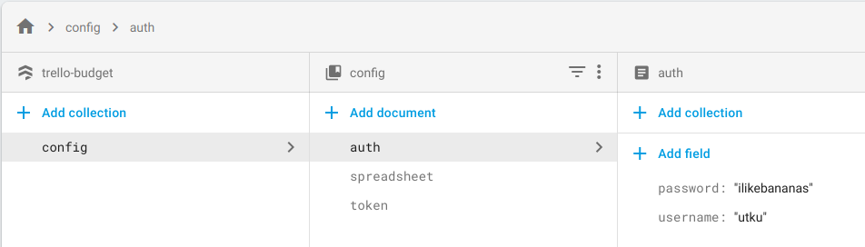

# Trello Budget
Quickly insert transactions in your budget spreadsheet by creating a Trello card.

### Walkthrough
Check out the [YouTube playlist](https://www.youtube.com/playlist?list=PL36SguL4LIwmJTYLlnCMXG5Azrpezm4h1) for a complete walkthrough on building this project.

### Installation & Configuration
#### Generate Auth Token for Spreadsheets 
1. [Create a new Firebase project](https://console.firebase.google.com/) called `budget.`
2. `pip3 install --upgrade google-api-python-client oauth2client`
3. Follow [quickstart guide step 1](https://developers.google.com/sheets/api/quickstart/python#step_1_turn_on_the) to enable the Google Sheets API and download credentials for your Firebase budget project .
4. Copy the `credentials.json` file in project directory and run the following to generate `token.json`:
    ``` sh
    python3 createtoken.py
    ```

#### Set Up the Firebase CLI
1. [Install Node.js & npm](https://nodejs.org/en/download/package-manager/)
2. `npm install firebase-functions@latest firebase-admin@latest --save`
3. `sudo npm install -g firebase-tools`

#### Initialize Firebase SDK for Cloud Functions
1. Run `firebase login` to authenticate the firebase tool.
2. Make sure that your Firebase project name & ID are correctly configured in [`.firebaserc:`](.firebaserc) 
    ``` json
    {
        "projects": {
            "budget": "<project-ID>"
        }
    }
    ```
 * Run `npm install` from the [`functions`](functions)  directory.

#### Create a Trello Webhook
Set the following fields in [`webhook.sh`](webhook.sh) & run it to create a Trello webhook:
 * `APIToken`
 * `APIKey`
 * `CallbackURL`
 * `ModelID`
``` sh
./webhook.sh
```

### Serve Locally or Deploy to Cloud
Serve functions locally without deploying functions to cloud:
``` sh
# default port is 5000
sudo firebase serve --only functions --port=5123
```

Deploy functions to cloud:
``` sh
firebase deploy --only functions
```

### Invoke Functions
 * Create a new collection called `config` in your Cloud Firestore and create a document called `auth` in it.
 * Set your username, password & [trello secret](https://trello.com/app-key) in it as shown below:

 

 * Also create an `auth.json` file in the project directory and set the same username & password in it as well:
    ``` json
    {  
        "username":"utku",
        "password":"ilikebananas"
    }
    ```
 * Finally make sure to set `LOCAL_PORT` correctly in [`post.py`](post.py) while serving functions locally.

#### Local Endpoint 
``` sh
# set spreadsheet ID by URL
python3 post.py local setSheet <SPREADSHEET_URL>

# set auth token
python3 post.py local setToken token.json

# make a transaction request
python3 post.py local transaction trello.json
```

#### Remote Endpoint
``` sh
# set spreadsheet ID by URL
python3 post.py remote setSheet <SPREADSHEET_URL>

# set auth token
python3 post.py remote setToken token.json

# make a transaction request
python3 post.py remote transaction trello.json
```

### References
 * [Trello Webhooks Guide](https://developers.trello.com/page/webhooks)
 * [Trello Webhooks Reference](https://developers.trello.com/reference#webhooks)
 * [Firebase Cloud Functions Guide](https://firebase.google.com/docs/functions/get-started)
 * [Google Spreadsheets API](https://developers.google.com/sheets/api/quickstart/nodejs)
 * [Express API](http://expressjs.com/en/4x/api.html)
